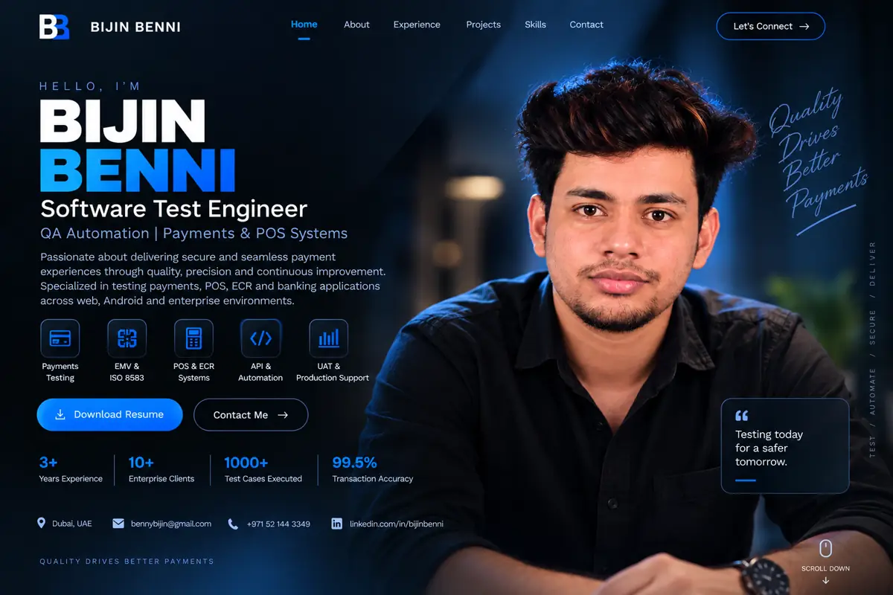

# Bijin Benni — Professional Portfolio

<p align="center">
  <a href="https://bijin1830.github.io"></a>
  <a href="https://github.com/bijin1830"></a>
  <a href="https://www.linkedin.com/in/bijinbenni"></a>
</p>

## Overview

This repository hosts my personal portfolio website as a **Software Test Engineer** focused on **Manual QA, Payments, POS, ECR, ISO 8583, EMV, API testing, SQL validation, UAT and production support**.

The portfolio presents my strongest hands-on QA experience: understanding requirements, validating payment flows, reproducing defects, checking API/database behavior, supporting integrations and verifying fixes across test and production-like environments.

## Live Demo

**Website:** https://bijin1830.github.io

## Portfolio Preview

<p align="center">
  <a href="https://bijin1830.github.io">
    
  </a>
</p>

## Professional Focus

- Manual functional testing
- Regression, integration, SIT and UAT testing
- Payment application testing
- ISO 8583 transaction validation
- EMV contact / contactless testing
- POS and Android POS validation
- ECR integration testing
- REST API testing using Postman
- Database validation using SQL
- Defect reproduction and log analysis
- Retesting and regression after fixes
- Production support and root-cause investigation

## Payments QA Highlights

- Purchase, void, refund, reversal and settlement lifecycle validation
- POS / ECR integration and communication-flow testing
- ISO 8583 request / response and response-code analysis
- EMV contact and contactless flow validation
- Timeout, fallback and Last Transaction scenario testing
- API and database validation around payment transactions
- UAT support, production issue reproduction and evidence collection

## Core Tools & Technologies

<p>
  
  
  
  
  
  
  
  
</p>

**Currently expanding automation skills:** Newman · Selenium · Python scripting

## Key Portfolio Sections

- **Professional Branding** — Software Test Engineer | Manual QA | Payments & POS Systems | API Testing
- **About Me** — summary of QA and payment-domain experience
- **Core Expertise** — ISO 8583, EMV, POS/ECR, API testing, SQL, defect analysis and support
- **Experience** — OMA Emirates Group and Aabasoft Technologies
- **Featured Work** — manual QA, payment testing and API testing projects
- **Contact** — portfolio, LinkedIn, email and resume access

## Featured QA Projects

### [Payment Testing Case Study](https://github.com/bijin1830/payment-testing-case-study)
A sanitized manual payment-testing case study covering POS/ECR transaction scenarios, purchase, void, refund, reversal, fallback, settlement, ISO 8583 validation, EMV flow, defect examples and UAT checks.

### [Manual Testing Portfolio](https://github.com/bijin1830/manual-testing-portfolio)
A manual QA documentation showcase with test planning, test scenarios, detailed test cases, RTM, defect examples, regression checks, UAT readiness and reusable templates.

### [API Testing Showcase](https://github.com/bijin1830/api-testing-framework)
A Postman-focused REST API testing project with positive/negative validation, environment variables, Newman execution and GitHub Actions for demonstration and continuous validation.

## Repository Structure

```text
.
├── index.html                   # Main portfolio website
├── hero_full.svg                # Portfolio hero artwork
├── hero_small_70.webp           # Portfolio preview image
├── favicon.svg                  # Site favicon
├── Bijin_Benni_Resume_2026.pdf  # Resume used by the portfolio
└── README.md                    # Project documentation
```

## Deployment

This portfolio is deployed using **GitHub Pages** from the `main` branch.

Updates pushed to `index.html` or supporting assets are published through the same repository.

## About Me

I am a Software Test Engineer based in the UAE with 3+ years of experience across payment systems, POS terminals, ECR integrations, API testing, database validation, UAT and production support.

My strongest areas are:

`Manual Testing` · `ISO 8583` · `EMV` · `POS` · `ECR` · `TMS` · `Payments QA` · `API Testing` · `SQL` · `UAT` · `Production Support`

## Contact

- Portfolio: https://bijin1830.github.io
- GitHub: https://github.com/bijin1830
- LinkedIn: https://www.linkedin.com/in/bijinbenni
- Email: bennybijin@gmail.com

---

<p align="center"><b>Quality drives better payments.</b></p>
